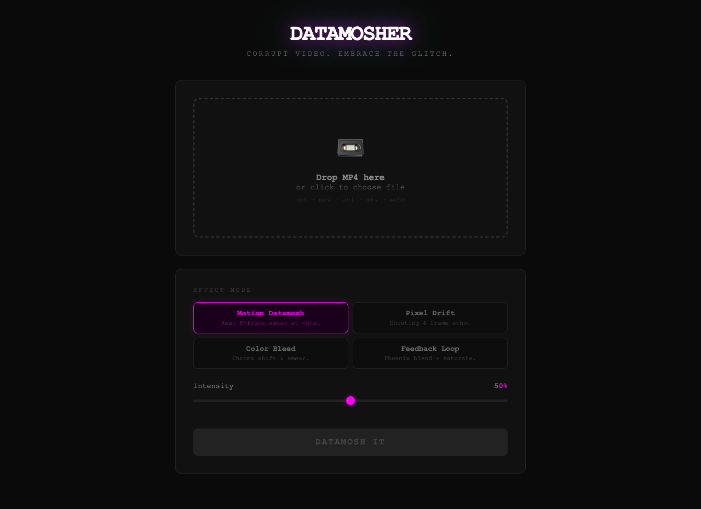

# Datamosher

<p align="center">
  
</p>

A local browser app for glitching videos with motion-vector datamoshing.

Datamosher runs a small Flask server on your machine, lets you upload a video, applies ffmpeg-based glitch effects, and downloads the rendered MP4.

Built for the Hermes Agent hackathon.

## Preview



## Effects

- Motion Datamosh: MPEG4 P-frame duplication plus I-VOP stripping for motion-vector smear at scene cuts.
- Pixel Drift: frame echo and blur.
- Color Bleed: chroma shift with temporal blending.
- Feedback Loop: phoenix blend, saturation, and sharpening.

## Requirements

- Python 3.10+
- ffmpeg and ffprobe available on your PATH

macOS with Homebrew:

```bash
brew install python ffmpeg
```

Ubuntu/Debian:

```bash
sudo apt update
sudo apt install python3 python3-venv ffmpeg
```

## Install

```bash
git clone https://github.com/noper69/datamosher.git
cd datamosher
python3 -m venv .venv
source .venv/bin/activate
python -m pip install --upgrade pip
python -m pip install -r requirements.txt
```

## Run

```bash
source .venv/bin/activate
python app.py
```

Open:

```text
http://127.0.0.1:5555/
```

The app is local-only by default. It binds to `127.0.0.1`, not the public network.

## Usage

1. Open the local web UI.
2. Upload an MP4, MOV, AVI, MKV, or WebM video.
3. Pick an effect and intensity.
4. Render the effect.
5. Download the generated MP4.

## Data and generated files

By default, uploads and renders are written to:

```text
./data/uploads/
./data/outputs/
```

These folders are ignored by git.

To use a different data directory:

```bash
DATAMOSHER_DATA_DIR=/tmp/datamosher-data python app.py
```

To change the max upload size in MB:

```bash
DATAMOSHER_MAX_UPLOAD_MB=1000 python app.py
```

If ffmpeg or ffprobe are not on PATH, set explicit paths:

```bash
FFMPEG_BINARY=/opt/homebrew/bin/ffmpeg FFPROBE_BINARY=/opt/homebrew/bin/ffprobe python app.py
```

## How the motion datamosh works

The main effect follows the classic datamosh approach:

```text
Upload video
  -> detect scene cuts
  -> encode MPEG4 segments with no B-frames
  -> duplicate P-VOP frames around cuts
  -> strip the next segment's I-VOP
  -> decode motion vectors against the previous image
  -> re-encode to H.264 MP4 for browser playback
```

Detailed steps:

1. Detect scene cuts with ffmpeg.
2. Encode clip segments as MPEG4 with no B-frames and no scene keyframes.
3. Extract MPEG4 elementary streams as `.m4v`.
4. Duplicate the last P-VOP from the previous segment.
5. Strip the next segment's I-VOP.
6. Decode the resulting stream so motion vectors from the new shot smear the old reference frame.
7. Re-encode to H.264 MP4 for browser playback.

If no hard cuts are detected, the app creates artificial split points so one-shot clips can still produce an effect.

## Known limitations

- Large videos can take a while to process.
- The strongest motion datamosh effect appears when the source video has hard cuts and visible motion.
- ffmpeg/ffprobe must be installed separately.
- The app is local-only and is not intended to be deployed publicly as-is.

## Development

Syntax check:

```bash
python -m py_compile app.py
```

Quick server check:

```bash
python app.py
curl http://127.0.0.1:5555/
```

Health/dependency check:

```bash
curl http://127.0.0.1:5555/health
```

## Privacy

Uploaded videos and generated outputs stay on your local machine unless you choose to share them.

## License

PolyForm Noncommercial License 1.0.0. See `LICENSE`.

Commercial use is not permitted without separate permission.
